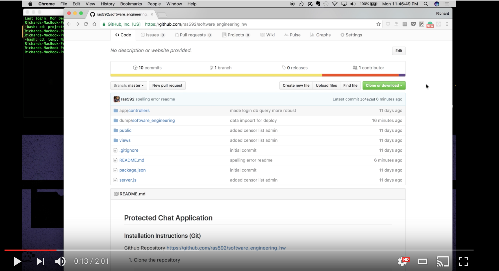

## Protected Chat Application

### Installation Instructions (Git)
[](https://www.youtube.com/Ds4Zy8Ara4k "Installation with Git")

https://www.youtube.com/Ds4Zy8Ara4k
<br>
[](https://www.youtube.com/X3g2ptupuZk "Downloading without Git")

Github Repository https://github.com/ras592/software_engineering_hw

1. Clone the repository

    ```shell
    > git clone https://github.com/ras592/software_engineering_hw.git
    ```
2. "cd" into newly created directory

    ```shell
    > cd software_engineering_hw/
    ```
3. Run npm install

    ```shell
    > npm install
    ```
4. In a new terminal window run the MongoDB daemon.

    ```shell
    > mongod
    ```
5. Restore the MongoDB data from dump data.

    ```shell
    > mongorestore
    ```
6. Run the server with Node.js

    ```shell
    > node server.js
    ```
7. Open in a web browser the application at localhost:3000

Links for downloads:
- https://nodejs.org/en/
- https://www.mongodb.com/download-center?jmp=nav#community
